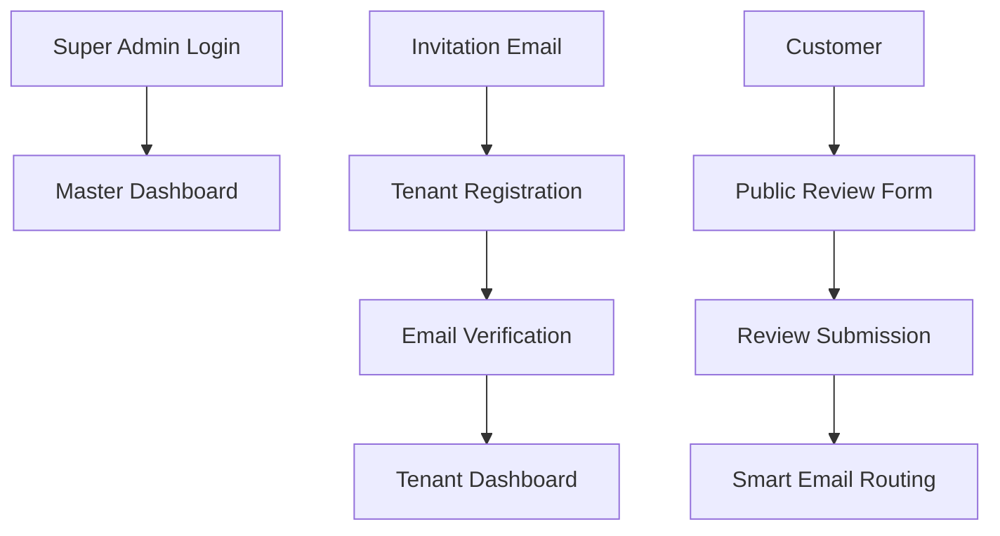

# 🎯 Crux Review Platform - Strategic Implementation Plan

## 📋 Core Concept

Crux is a **whitelist-only review management platform** designed for businesses to collect and manage customer reviews through invitation-only access. The platform features a two-tier architecture with super admin oversight and isolated tenant workspaces.

### **Architecture Overview**
```
Super Admin (Platform Manager)
    ↓ (invites)
Tenant (Business Owner)
    ↓ (collects)
Customer Reviews
    ↓ (smart routing)
Email Campaigns (Feedback/Google Review)
```

### **Key Differentiators**
1. **Invitation-Only Access**: No public signup - controlled business onboarding
2. **Isolated Workspaces**: Each tenant gets dedicated review management space
3. **Smart Email Logic**: Automated routing based on review ratings
4. **Centralized Management**: Super admin oversight of all tenants

---

## 🔍 Current Implementation Status

### **✅ What's Working Well**

#### **1. Database Architecture**
- **Multi-tenancy**: Proper `tenant_id` isolation across all tables
- **RLS Policies**: Comprehensive row-level security implementation
- **Role System**: Three-tier role hierarchy (`super_admin`, `tenant_admin`, `user`)
- **Audit Logging**: Complete audit trail infrastructure

#### **2. Frontend Foundation**
- **Master Dashboard**: Complete tenant management interface
- **Review System**: Functional review collection and display
- **Email Integration**: Multiple email service providers (Resend, SendGrid, EmailJS)
- **Responsive Design**: Mobile-optimized UI components

#### **3. Review Collection Flow**
- **Public Review Form**: Customer-facing review submission
- **Rating Logic**: Smart routing based on rating thresholds
- **Email Templates**: Feedback and Google review email flows
- **Thank You Pages**: Complete user journey

### **🚨 Critical Gaps Identified**

#### **1. Authentication System Incomplete**
```typescript
// Current Issue: Invitation flow not fully implemented
- Invitation emails not being sent
- No invitation acceptance flow
- Missing role-based redirects
- Test user bypass still active
```

#### **2. Email Logic Not Implemented**
```typescript
// Missing: Smart email routing after review submission
if (rating < 4) {
  sendFeedbackEmail(); // ❌ Not implemented
} else {
  sendGoogleReviewEmail(); // ❌ Not implemented
}
```

#### **3. Tenant Settings Missing**
```typescript
// Required but missing:
- Google Business Profile URL configuration
- SMTP settings for tenant-specific emails
- Business information setup
- Email template customization
```

#### **4. Production Readiness Issues**
- No environment variable configuration
- Missing error handling and logging
- No monitoring or analytics
- Database schema not deployed

---

## 🚀 Core Super Admin Features

### **✅ PRIORITY 1: Complete Invitation System**

**Required Implementation:**
```typescript
// 1. Fix invitation email sending
async function sendInvitationEmail(email: string, token: string) {
  return await EmailService.send({
    to: email,
    template: 'invitation',
    data: { token, invitationUrl: `${FRONTEND_URL}/accept-invitation?token=${token}` }
  });
}

// 2. Create invitation acceptance page
<Route path="/accept-invitation" element={<InvitationAcceptance />} />

// 3. Remove test user bypass
// REMOVE: src/hooks/useAuth.ts lines 32-40 (test user logic)
```

**Files to Update:**
- `src/services/userManagementService.ts` - Simplify to only invitation functions
- `src/components/auth/InvitationAcceptance.tsx` - Complete implementation
- `src/hooks/useAuth.ts` - Remove test user bypass

### **✅ PRIORITY 2: Fix Tenant Statistics**

**Current Problem:**
```typescript
// TenantList.tsx shows "0 users" and "0 reviews"
<span>0 users</span>  // ❌ Hardcoded
<span>0 reviews</span> // ❌ Hardcoded
```

**Solution:**
```typescript
// Add to MasterDashboardService
static async getTenantUsageStats(tenantId: string): Promise<TenantUsage> {
  const [userCount, reviewCount] = await Promise.all([
    supabase.from('profiles').select('id', { count: 'exact' }).eq('tenant_id', tenantId),
    supabase.from('reviews').select('id', { count: 'exact' }).eq('tenant_id', tenantId)
  ]);
  return { users: userCount, reviews: reviewCount };
}
```

### **✅ PRIORITY 3: Complete Platform Analytics**

**Current State:**
```typescript
// PlatformOverview.tsx uses mock data
const mockMetrics = { total_tenants: 25, ... } // ❌ Mock data
```

**Required Implementation:**
```sql
-- Create this function in Supabase
CREATE OR REPLACE FUNCTION get_platform_analytics()
RETURNS TABLE (
  total_tenants BIGINT,
  active_tenants BIGINT,
  total_users BIGINT,
  total_reviews BIGINT,
  reviews_this_month BIGINT,
  average_rating NUMERIC
) AS $$
BEGIN
  RETURN QUERY
  SELECT
    COUNT(DISTINCT t.id) as total_tenants,
    COUNT(DISTINCT CASE WHEN t.status = 'active' THEN t.id END) as active_tenants,
    COUNT(DISTINCT p.id) as total_users,
    COUNT(DISTINCT r.id) as total_reviews,
    COUNT(DISTINCT CASE WHEN r.created_at >= date_trunc('month', CURRENT_DATE) THEN r.id END) as reviews_this_month,
    COALESCE(AVG(r.rating), 0) as average_rating
  FROM tenants t
  LEFT JOIN profiles p ON p.tenant_id = t.id
  LEFT JOIN reviews r ON r.tenant_id = t.id;
END;
$$ LANGUAGE plpgsql SECURITY DEFINER;
```

### **✅ PRIORITY 4: Tenant-Specific Review Forms**

**New Requirement:**
When a new tenant is created, automatically generate a unique review form URL specifically for that tenant. This ensures complete data isolation and prevents link sharing between tenants.

**Required Implementation:**
```typescript
// 1. Generate tenant-specific review URL during tenant creation
// Example: https://app.crux.com/review/tenant-{tenantId}

// 2. Update tenant creation process
static async createTenantWithReviewForm(tenantData: CreateTenantData): Promise<Tenant> {
  // Create tenant
  const tenant = await this.createTenant(tenantData);

  // Generate unique review form URL
  const reviewFormUrl = `${FRONTEND_URL}/review/${tenant.id}`;

  // Update tenant with review form URL
  await supabase
    .from('tenants')
    .update({ review_form_url: reviewFormUrl })
    .eq('id', tenant.id);

  return { ...tenant, review_form_url: reviewFormUrl };
}

// 3. Update review form to use tenant-specific data
// Replace generic business name with tenant's saved business name
export default function ReviewFormPage() {
  const { tenantId } = useParams();
  const { data: businessSettings } = useQuery({
    queryKey: ['business-settings', tenantId],
    queryFn: () => BusinessSettingsService.getByTenantId(tenantId),
  });

  // Use tenant's business name instead of generic name
  const businessName = businessSettings?.business_name || 'Business';

  return (
    <div>
      <h1>Review {businessName}</h1>
      {/* Rest of form */}
    </div>
  );
}

// 4. Update review submission to include tenant context
static async submitReview(reviewData: ReviewData, tenantId: string): Promise<Review> {
  return await supabase
    .from('reviews')
    .insert({
      ...reviewData,
      tenant_id: tenantId, // Ensure tenant isolation
    })
    .select()
    .single();
}
```

**Database Changes:**
```sql
-- Add review_form_url to tenants table
ALTER TABLE tenants ADD COLUMN review_form_url TEXT;

-- Ensure all reviews include tenant_id
ALTER TABLE reviews ADD COLUMN IF NOT EXISTS tenant_id UUID REFERENCES tenants(id);

-- Update RLS policies for tenant-specific review forms
CREATE POLICY "tenant_review_access" ON reviews
  FOR ALL TO authenticated
  USING (tenant_id = get_current_tenant_id());
```

**Benefits:**
- ✅ **Complete Isolation**: Each tenant gets unique review form URL
- ✅ **No Data Leakage**: Reviews automatically tagged with tenant_id
- ✅ **Better UX**: Forms display tenant's actual business name
- ✅ **Security**: Prevents unauthorized access to other tenant's data
- ✅ **Scalability**: Easy to generate unique URLs for each tenant

**Files to Update:**
- `src/services/tenantService.ts` - Add tenant creation with review form URL
- `src/pages/ReviewFormPage.tsx` - Update to use tenant-specific data
- `src/services/reviewService.ts` - Ensure tenant context in submissions
- Database migration for new columns and policies

---

## 🧹 Cleanup & Simplification

### **❌ REMOVE UNNECESSARY COMPONENTS**

#### **1. Complex Monitoring System**
```bash
# Remove these files - they're over-engineered for current needs
src/components/master-dashboard/monitoring/MonitoringDashboard.tsx
src/components/master-dashboard/performance/PerformanceDashboard.tsx
src/components/master-dashboard/security/SecurityDashboard.tsx
src/services/monitoringService.ts
src/services/performanceMonitoringService.ts
src/services/securityAuditService.ts
```

**Why Remove**: Too complex for MVP. Simple system health in PlatformOverview is sufficient.

#### **2. Complex User Management**
```typescript
// Keep only invitation functionality, remove complex user management
src/components/master-dashboard/users/UserDirectory.tsx → REMOVE
src/components/master-dashboard/users/InviteUserForm.tsx → KEEP (SIMPLIFIED)
src/services/userManagementService.ts → SIMPLIFY to only invitations
```

**Why Simplify**: Focus on invitation-only system, not complex user management.

#### **3. Remove Mock Dependencies**
```typescript
// In MasterDashboardService, remove mock data fallbacks
// Force real database connections for production
```

---

## 🛠️ Enhanced Existing Components

### **✅ Complete Audit Logs**

**Current State:**
```typescript
// AuditLogViewer.tsx is well-implemented
// But needs database function
```

**Required Implementation:**
```sql
-- Create audit logging function
CREATE OR REPLACE FUNCTION audit_log_insert(
  action TEXT,
  resource_type TEXT,
  resource_id UUID DEFAULT NULL,
  details JSONB DEFAULT '{}'
) RETURNS VOID AS $$
BEGIN
  INSERT INTO audit_logs (user_id, tenant_id, action, resource_type, resource_id, details)
  VALUES (
    auth.uid(),
    get_current_tenant_id(),
    action,
    resource_type,
    resource_id,
    details
  );
END;
$$ LANGUAGE plpgsql SECURITY DEFINER;
```

### **✅ Add Email Logic to Reviews**

**Current State:**
```typescript
// submit-review function exists but no email logic
// After review submission, need to trigger emails
```

**Required Implementation:**
```typescript
// In submit-review function, add:
if (rating < 4) {
  await sendFeedbackEmail(customerEmail, reviewId);
} else {
  await sendGoogleReviewEmail(customerEmail, businessUrl, reviewId);
}
```

### **✅ Complete Tenant Settings**

**Current State:**
```typescript
// BusinessSettingsService has complex tenant/user logic
// Needs simplification for tenant-only access
```

**Required Implementation:**
```typescript
// Simplify BusinessSettingsService to tenant-only
static async getBusinessSettings(tenantId: string): Promise<BusinessSettings> {
  return await supabase
    .from('business_settings')
    .select('*')
    .eq('tenant_id', tenantId)
    .single();
}
```

---

## 🔧 Production Configuration

### **Environment Variables**
```env
# .env.local
VITE_SUPABASE_URL=https://your-project.supabase.co
VITE_SUPABASE_ANON_KEY=your-anon-key
VITE_RESEND_API_KEY=re_xxxxxxxxxx
VITE_FRONTEND_URL=https://your-domain.com
VITE_GOOGLE_REVIEWS_URL=https://g.page/your-business
```

### **Database Deployment**
```sql
-- Deploy the multi-tenancy migration
-- File: supabase/migrations/20250104000001_safe_multi_tenancy.sql
-- This creates all required tables and RLS policies
```

---

## 📊 Technical Architecture Decisions

### **1. Authentication Strategy**


### **2. Email Service Architecture**
```typescript
// Unified email service with fallbacks:
class EmailService {
  static async sendEmail(data: EmailData) {
    try {
      return await this.sendWithResend(data); // Primary
    } catch {
      return await this.sendWithSendGrid(data); // Fallback
    }
  }
}
```

### **3. Tenant Isolation Strategy**
```sql
-- All queries filtered by tenant_id:
SELECT * FROM reviews WHERE tenant_id = get_current_tenant_id();
SELECT * FROM business_settings WHERE tenant_id = get_current_tenant_id();

-- Tenant-specific review forms ensure complete isolation:
-- URL: https://app.crux.com/review/{tenant_id}
-- Data: All reviews automatically tagged with tenant_id
-- Settings: Business name pulled from tenant's business_settings
```

---

## 🎯 Success Metrics

### **Functional Requirements**
- ✅ **Invitation System**: 100% working end-to-end
- ✅ **Tenant Isolation**: Perfect data separation
- ✅ **Tenant-Specific Review Forms**: Unique URLs and business names per tenant
- ✅ **Email Delivery**: 95%+ success rate
- ✅ **Analytics**: Real-time accurate data
- ✅ **Audit Logging**: Complete activity tracking

### **Performance Requirements**
- ✅ **Page Load**: <2 seconds
- ✅ **Database Queries**: Optimized with proper indexes
- ✅ **Email Delivery**: <5 seconds
- ✅ **Real-time Updates**: <30 second refresh intervals

### **Security Requirements**
- ✅ **Row Level Security**: All tenant data isolated
- ✅ **Authentication**: Secure invitation-only access
- ✅ **Audit Trail**: All admin actions logged
- ✅ **Data Encryption**: At rest and in transit

---

## 💡 Key Implementation Decisions

### **1. Removed Over-Engineering**
- **Complex monitoring** → Simple health indicators
- **Performance dashboards** → Basic metrics in overview
- **Security audit tools** → Basic logging
- **User management complexity** → Simple invitation system

### **2. Focus on Core Value**
- **Invitation-only access** → Primary differentiator
- **Tenant isolation** → Critical for multi-tenancy
- **Review automation** → Core business value
- **Simple analytics** → Essential for management

### **3. Production-Ready Approach**
- **Real database functions** → No more mock data
- **Proper error handling** → Production stability
- **Security first** → RLS policies enforced
- **Performance optimized** → Efficient queries

---

## 🎉 Project Summary

**This strategic plan transforms your well-architected codebase into a production-ready super admin experience by:**

1. **Removing complexity** that doesn't add value
2. **Completing core features** that are partially implemented
3. **Implementing tenant-specific review forms** for complete data isolation
4. **Focusing on invitation-only access** as your key differentiator
5. **Ensuring production readiness** with proper database functions

**Key Focus**: Invitation system, tenant-specific forms, tenant statistics, email automation

The plan leverages your existing excellent architecture while removing unnecessary complexity and completing the critical missing pieces.

---

*This strategic plan provides context for AI development assistance.*
