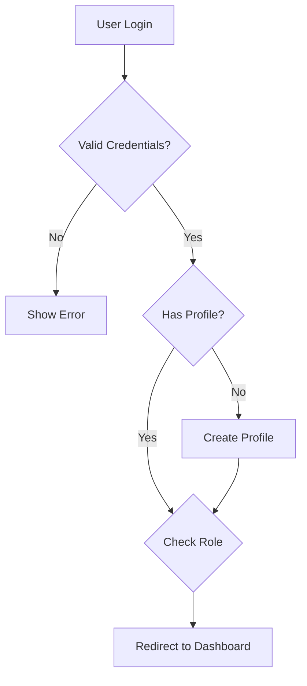

# Crux Review Management System - Technical Documentation

## Table of Contents
1. [Architecture Overview](#architecture-overview)
2. [Database Schema](#database-schema)
3. [API Documentation](#api-documentation)
4. [Authentication & Authorization](#authentication--authorization)
5. [Multi-Tenancy](#multi-tenancy)
6. [Security](#security)
7. [Deployment Guide](#deployment-guide)
8. [Development Setup](#development-setup)
9. [Testing](#testing)
10. [Monitoring & Maintenance](#monitoring--maintenance)

---

## Architecture Overview

### Tech Stack
- **Frontend**: React 18.3.1 + TypeScript + Vite + Tailwind CSS + Shadcn/ui
- **Backend**: Supabase (PostgreSQL + Auth + Edge Functions)
- **State Management**: TanStack Query (React Query)
- **Forms**: React Hook Form + Zod validation
- **Icons**: Lucide React
- **Charts**: Recharts
- **Build**: Vite with SWC, managed with Bun

### System Architecture
```
┌─────────────────┐    ┌─────────────────┐    ┌─────────────────┐
│   Frontend      │    │   Supabase      │    │   External      │
│   (React)       │◄──►│   Backend       │◄──►│   Services      │
│                 │    │                 │    │                 │
│ • Dashboard     │    │ • PostgreSQL    │    │ • Email Service │
│ • Review Forms  │    │ • Auth          │    │ • File Storage  │
│ • Admin Panel   │    │ • Edge Functions│    │ • Analytics     │
└─────────────────┘    └─────────────────┘    └─────────────────┘
```

---

## Database Schema

### Core Tables

#### `tenants`
Multi-tenant isolation table
```sql
CREATE TABLE tenants (
  id UUID PRIMARY KEY DEFAULT gen_random_uuid(),
  name VARCHAR(255) NOT NULL,
  domain VARCHAR(255),
  plan_type VARCHAR(50) DEFAULT 'basic',
  status VARCHAR(50) DEFAULT 'active',
  settings JSONB DEFAULT '{}',
  billing_email VARCHAR(255),
  created_at TIMESTAMP WITH TIME ZONE DEFAULT NOW(),
  updated_at TIMESTAMP WITH TIME ZONE DEFAULT NOW(),
  created_by UUID REFERENCES auth.users(id)
);
```

#### `profiles`
User profiles with tenant association
```sql
CREATE TABLE profiles (
  id UUID PRIMARY KEY REFERENCES auth.users(id),
  tenant_id UUID REFERENCES tenants(id) NOT NULL,
  role VARCHAR(50) DEFAULT 'user',
  first_name VARCHAR(100),
  last_name VARCHAR(100),
  avatar_url TEXT,
  created_at TIMESTAMP WITH TIME ZONE DEFAULT NOW(),
  updated_at TIMESTAMP WITH TIME ZONE DEFAULT NOW()
);
```

#### `reviews`
Customer reviews with tenant isolation
```sql
CREATE TABLE reviews (
  id UUID PRIMARY KEY DEFAULT gen_random_uuid(),
  tenant_id UUID REFERENCES tenants(id) NOT NULL,
  customer_name VARCHAR(255) NOT NULL,
  customer_email VARCHAR(255),
  rating INTEGER CHECK (rating >= 1 AND rating <= 5),
  review_text TEXT,
  status VARCHAR(50) DEFAULT 'pending',
  created_at TIMESTAMP WITH TIME ZONE DEFAULT NOW(),
  updated_at TIMESTAMP WITH TIME ZONE DEFAULT NOW()
);
```

### Supporting Tables

#### `user_invitations`
Invitation management
```sql
CREATE TABLE user_invitations (
  id UUID PRIMARY KEY DEFAULT gen_random_uuid(),
  tenant_id UUID REFERENCES tenants(id) NOT NULL,
  email VARCHAR(255) NOT NULL,
  role VARCHAR(50) NOT NULL,
  token VARCHAR(255) UNIQUE NOT NULL,
  expires_at TIMESTAMP WITH TIME ZONE NOT NULL,
  status VARCHAR(50) DEFAULT 'pending',
  invited_by UUID REFERENCES auth.users(id),
  created_at TIMESTAMP WITH TIME ZONE DEFAULT NOW()
);
```

#### `audit_logs`
Comprehensive audit logging
```sql
CREATE TABLE audit_logs (
  id UUID PRIMARY KEY DEFAULT gen_random_uuid(),
  tenant_id UUID REFERENCES tenants(id),
  user_id UUID REFERENCES auth.users(id),
  action VARCHAR(100) NOT NULL,
  resource_type VARCHAR(100),
  resource_id UUID,
  details JSONB,
  ip_address INET,
  user_agent TEXT,
  created_at TIMESTAMP WITH TIME ZONE DEFAULT NOW()
);
```

---

## API Documentation

### Authentication Endpoints

#### `POST /auth/v1/signup`
Create new user account
```typescript
interface SignupRequest {
  email: string;
  password: string;
  invitation_token?: string;
}

interface SignupResponse {
  user: User;
  session: Session;
}
```

#### `POST /auth/v1/token`
Sign in user
```typescript
interface SigninRequest {
  email: string;
  password: string;
}

interface SigninResponse {
  user: User;
  session: Session;
  access_token: string;
  refresh_token: string;
}
```

### Review Management Endpoints

#### `GET /reviews`
Get reviews for current tenant
```typescript
interface GetReviewsRequest {
  page?: number;
  limit?: number;
  status?: 'pending' | 'approved' | 'rejected';
  rating?: number;
}

interface GetReviewsResponse {
  reviews: Review[];
  total: number;
  page: number;
  limit: number;
}
```

#### `POST /reviews`
Create new review
```typescript
interface CreateReviewRequest {
  customer_name: string;
  customer_email?: string;
  rating: number;
  review_text: string;
}

interface CreateReviewResponse {
  review: Review;
  success: boolean;
}
```

### Tenant Management Endpoints (Super Admin)

#### `GET /tenants`
Get all tenants
```typescript
interface GetTenantsResponse {
  tenants: Tenant[];
  total: number;
}
```

#### `POST /tenants`
Create new tenant
```typescript
interface CreateTenantRequest {
  name: string;
  domain?: string;
  plan_type: 'basic' | 'pro' | 'enterprise';
  admin_email: string;
}

interface CreateTenantResponse {
  tenant: Tenant;
  admin_user: User;
}
```

---

## Authentication & Authorization

### Role-Based Access Control (RBAC)

#### Roles
1. **super_admin**: Platform administrator
   - Access to master dashboard
   - Manage all tenants
   - View platform analytics
   - Manage system settings

2. **tenant_admin**: Tenant administrator
   - Manage tenant users
   - Configure tenant settings
   - View tenant analytics
   - Manage reviews

3. **user**: Regular tenant user
   - Submit reviews
   - View own reviews
   - Basic tenant features

### Authentication Flow


### Protected Routes
```typescript
// Master Dashboard (Super Admin Only)
<Route path="/master/*" element={
  <ProtectedRoute requiredRole="super_admin">
    <MasterDashboardLayout />
  </ProtectedRoute>
} />

// Tenant Dashboard (Tenant Admin/User)
<Route path="/dashboard/*" element={
  <ProtectedRoute requiredRole={["tenant_admin", "user"]}>
    <DashboardLayout />
  </ProtectedRoute>
} />
```

---

## Multi-Tenancy

### Tenant Isolation Strategy
- **Database Level**: All tables include `tenant_id` column
- **Row Level Security**: RLS policies enforce tenant isolation
- **Application Level**: Services filter by tenant context

### RLS Policies
```sql
-- Example RLS Policy
CREATE POLICY "tenant_isolation" ON reviews
  FOR ALL USING (tenant_id = get_current_tenant_id());

-- Super admin bypass
CREATE POLICY "super_admin_access" ON reviews
  FOR ALL USING (is_super_admin(auth.uid()));
```

### Tenant Context Functions
```sql
-- Get current user's tenant
CREATE OR REPLACE FUNCTION get_current_tenant_id()
RETURNS UUID AS $$
BEGIN
  RETURN (
    SELECT tenant_id 
    FROM profiles 
    WHERE id = auth.uid()
  );
END;
$$ LANGUAGE plpgsql SECURITY DEFINER;

-- Check if user is super admin
CREATE OR REPLACE FUNCTION is_super_admin(user_id UUID)
RETURNS BOOLEAN AS $$
BEGIN
  RETURN (
    SELECT role = 'super_admin' 
    FROM profiles 
    WHERE id = user_id
  );
END;
$$ LANGUAGE plpgsql SECURITY DEFINER;
```

---

## Security

### Security Measures
1. **Authentication**: Supabase Auth with JWT tokens
2. **Authorization**: Role-based access control
3. **Data Protection**: Row Level Security (RLS)
4. **Input Validation**: Zod schema validation
5. **Audit Logging**: Comprehensive activity tracking
6. **Rate Limiting**: API rate limiting (Supabase)
7. **HTTPS**: All communications encrypted

### Security Audit Checklist
- [x] Authentication flows secured
- [x] RLS policies implemented
- [x] Input sanitization in place
- [x] SQL injection prevention
- [x] XSS protection
- [x] CSRF protection
- [x] Audit logging enabled
- [x] Security monitoring active

---

## Deployment Guide

### Prerequisites
- Node.js 18+ and npm/bun
- Supabase account and project
- Domain name (optional)
- Email service (Resend/SendGrid)

### Environment Variables
```env
# Supabase Configuration
VITE_SUPABASE_URL=your_supabase_url
VITE_SUPABASE_ANON_KEY=your_supabase_anon_key
VITE_SUPABASE_SERVICE_ROLE_KEY=your_service_role_key

# Email Service
VITE_RESEND_API_KEY=your_resend_api_key

# Application Settings
VITE_APP_NAME="Crux"
VITE_SUPPORT_EMAIL="support@yourcompany.com"
VITE_FRONTEND_URL=https://yourdomain.com

# Security & Monitoring
VITE_SENTRY_DSN=your_sentry_dsn
VITE_GA_TRACKING_ID=your_ga_tracking_id
```

### Deployment Steps

#### 1. Database Setup
```bash
# Apply migrations
supabase db push

# Create super admin user
psql -h your-db-host -U postgres -d postgres -f scripts/promote-super-admin.sql
```

#### 2. Frontend Deployment
```bash
# Build for production
npm run build

# Deploy to Vercel/Netlify
vercel deploy --prod
```

#### 3. Domain Configuration
- Configure DNS records
- Set up SSL certificates
- Update CORS settings in Supabase

---

## Development Setup

### Local Development
```bash
# Clone repository
git clone https://github.com/your-org/crux-review-system.git
cd crux-review-system

# Install dependencies
npm install

# Set up environment
cp env.example .env.local
# Edit .env.local with your values

# Start development server
npm run dev
```

### Database Development
```bash
# Start Supabase locally
supabase start

# Apply migrations
supabase db reset

# Generate types
supabase gen types typescript --local > src/types/supabase.ts
```

### Code Standards
- **TypeScript**: Strict mode enabled
- **ESLint**: Airbnb configuration
- **Prettier**: Code formatting
- **Husky**: Pre-commit hooks
- **Conventional Commits**: Commit message format

---

## Testing

### Test Structure
```
tests/
├── unit/           # Unit tests
├── integration/    # Integration tests
├── e2e/           # End-to-end tests
└── fixtures/      # Test data
```

### Running Tests
```bash
# Unit tests
npm run test

# Integration tests
npm run test:integration

# E2E tests
npm run test:e2e

# Coverage report
npm run test:coverage
```

### Test Coverage Goals
- **Unit Tests**: 80%+ coverage
- **Integration Tests**: Critical paths covered
- **E2E Tests**: Main user flows tested

---

## Monitoring & Maintenance

### Application Monitoring
- **Performance**: Real-time metrics dashboard
- **Errors**: Error tracking with Sentry
- **Analytics**: User behavior tracking
- **Uptime**: Service availability monitoring

### Database Monitoring
- **Query Performance**: Slow query detection
- **Connection Pool**: Connection monitoring
- **Storage**: Disk usage tracking
- **Backups**: Automated backup verification

### Maintenance Tasks
- **Daily**: Backup verification
- **Weekly**: Security audit
- **Monthly**: Performance review
- **Quarterly**: Disaster recovery testing

### Backup Strategy
- **Frequency**: Daily automated backups
- **Retention**: 30 days local, 1 year archive
- **Encryption**: AES-256 encryption
- **Testing**: Monthly restore testing

---

## Troubleshooting

### Common Issues

#### Database Connection Issues
```bash
# Check Supabase status
supabase status

# Verify environment variables
echo $VITE_SUPABASE_URL
```

#### Authentication Problems
```bash
# Clear browser storage
localStorage.clear()

# Check user role
SELECT role FROM profiles WHERE id = auth.uid();
```

#### Build Issues
```bash
# Clear cache
npm run clean

# Reinstall dependencies
rm -rf node_modules package-lock.json
npm install
```

### Support
- **Documentation**: This file
- **Issues**: GitHub Issues
- **Email**: support@yourcompany.com
- **Slack**: #crux-support

---

*Last Updated: January 4, 2025*
*Version: 1.0.0*
